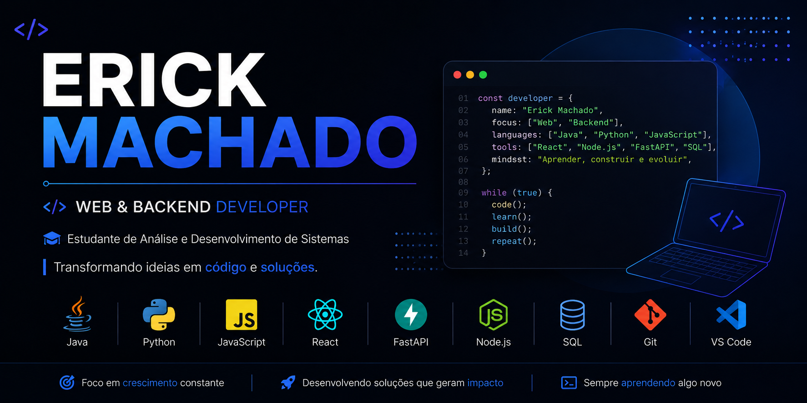

  

<h1 align="center">👨‍💻 Erick Machado</h1>

🎓 Estudante de Análise e Desenvolvimento de Sistemas

Sou estudante de **Análise e Desenvolvimento de Sistemas**, com foco em **desenvolvimento web e Fullstack**.

Tenho experiência em projetos utilizando **Java, Python, JavaScript, HTML/CSS, React, FastAPI, Node.js, SQL e Git**.

🚀 Atualmente desenvolvendo o **FitMind AI**, uma plataforma Full Stack para gerenciamento de treinos com autenticação JWT, APIs REST e dashboard interativo.

---

## 🚀 Linguagens e Tecnologias

  

---

## 🔥 Sequência de Commits

  

---

## 📫 Contato

